# Audit Management System (AMS) - Supabase Database Architecture & Visual Schema

This document outlines the normalized relational database schema, Entity-Relationship Diagram (ERD), table catalogs, global & firm template hierarchies, audit execution suite, findings, responses, and CAPA workflow for Supabase (PostgreSQL).

---

## 1. Database Entity-Relationship Diagram (Visual Schema)

```mermaid
erDiagram
    %% Master Firm and Users
    FIRM ||--o{ USERS : "employs"
    FIRM ||--o{ FIRM_TEMPLATES : "owns & customizes"
    FIRM ||--o{ AUDIT_PLANS : "conducts"
    
    %% Global Template Hierarchy
    GLOBAL_TEMPLATES ||--|{ GLOBAL_SECTIONS : "contains"
    GLOBAL_SECTIONS ||--|{ GLOBAL_QUESTIONS : "groups"
    
    %% Firm Template Hierarchy
    GLOBAL_TEMPLATES ||--o{ FIRM_TEMPLATES : "derived from"
    FIRM_TEMPLATES ||--|{ FIRM_SECTIONS : "contains"
    FIRM_SECTIONS ||--|{ FIRM_QUESTIONS : "groups"
    
    GLOBAL_SECTIONS ||--o{ FIRM_SECTIONS : "cloned from"
    GLOBAL_QUESTIONS ||--o{ FIRM_QUESTIONS : "cloned from"
    
    %% Audit Execution
    FIRM_TEMPLATES ||--o{ AUDIT_PLANS : "applied to"
    GLOBAL_TEMPLATES ||--o{ AUDIT_PLANS : "applied to"
    
    AUDIT_PLANS ||--|{ AUDIT_TEAM_MEMBERS : "assigns"
    USERS ||--o{ AUDIT_TEAM_MEMBERS : "participates in"
    
    AUDIT_PLANS ||--|{ AUDIT_CHECKLIST_RESPONSES : "records evaluation"
    FIRM_QUESTIONS ||--o{ AUDIT_CHECKLIST_RESPONSES : "evaluated in"
    GLOBAL_QUESTIONS ||--o{ AUDIT_CHECKLIST_RESPONSES : "evaluated in"
    
    %% Findings, Responses & CAPA Workflow
    AUDIT_PLANS ||--|{ AUDIT_FINDINGS : "identifies"
    FIRM_QUESTIONS ||--o{ AUDIT_FINDINGS : "clause violation"
    GLOBAL_QUESTIONS ||--o{ AUDIT_FINDINGS : "clause violation"
    
    AUDIT_FINDINGS ||--o{ AUDIT_FINDING_RESPONSES : "receives auditee/auditor responses"
    AUDIT_PLANS ||--o{ AUDIT_FINDING_RESPONSES : "tracks responses"
    
    AUDIT_FINDINGS ||--o| AUDIT_CORRECTIVE_ACTIONS : "remediated by"
    AUDIT_PLANS ||--o{ AUDIT_CORRECTIVE_ACTIONS : "tracks CAPA"
    
    %% Attachments & Audit Logs
    AUDIT_PLANS ||--o{ AUDIT_ATTACHMENTS : "supported by"
    AUDIT_FINDINGS ||--o{ AUDIT_ATTACHMENTS : "documented by"
    AUDIT_FINDING_RESPONSES ||--o{ AUDIT_ATTACHMENTS : "response evidence"
    AUDIT_CHECKLIST_RESPONSES ||--o{ AUDIT_ATTACHMENTS : "verified with"
    AUDIT_CORRECTIVE_ACTIONS ||--o{ AUDIT_ATTACHMENTS : "remediation proof"
    
    USERS ||--o{ AUDIT_LOGS : "triggers"

    FIRM {
        text id PK
        varchar code UK
        varchar name
        varchar contact_email
        varchar phone
        text address
        varchar website
        varchar established_year
        text quality_policy
        boolean is_active
        timestamptz created_at
        date created_on
        timestamptz last_modified_at
        date last_modified_on
    }

    USERS {
        text id PK
        varchar email UK
        text password_hash
        varchar name
        user_role_type role
        varchar phone
        text avatar
        text firm_id FK
        boolean is_active
        timestamptz last_login_at
        date last_login_on
        int failed_login_attempts
        timestamptz created_at
        date created_on
        timestamptz last_modified_at
        date last_modified_on
    }

    GLOBAL_TEMPLATES {
        text id PK
        varchar code UK
        varchar title
        varchar standard
        varchar industry
        varchar version
        numeric passing_score
        text_array tags
        text description
        text created_by FK
        boolean is_active
        timestamptz created_at
        date created_on
        timestamptz last_modified_at
        date last_modified_on
    }

    GLOBAL_SECTIONS {
        text id PK
        text global_template_id FK
        varchar title
        text description
        numeric weight
        int order_index
        timestamptz created_at
        date created_on
        timestamptz last_modified_at
        date last_modified_on
    }

    GLOBAL_QUESTIONS {
        text id PK
        text global_section_id FK
        varchar requirement_id
        text question
        text guidance
        varchar scoring_type
        numeric weight
        boolean mandatory
        int order_index
        timestamptz created_at
        date created_on
        timestamptz last_modified_at
        date last_modified_on
    }

    FIRM_TEMPLATES {
        text id PK
        text firm_id FK
        text global_template_id FK
        varchar code
        varchar title
        varchar standard
        varchar industry
        varchar version
        numeric passing_score
        text_array tags
        text description
        boolean is_custom
        text created_by FK
        boolean is_active
        timestamptz created_at
        date created_on
        timestamptz last_modified_at
        date last_modified_on
    }

    FIRM_SECTIONS {
        text id PK
        text firm_template_id FK
        text global_section_id FK
        varchar title
        text description
        numeric weight
        int order_index
        timestamptz created_at
        date created_on
        timestamptz last_modified_at
        date last_modified_on
    }

    FIRM_QUESTIONS {
        text id PK
        text firm_section_id FK
        text global_question_id FK
        varchar requirement_id
        text question
        text guidance
        varchar scoring_type
        numeric weight
        boolean mandatory
        int order_index
        timestamptz created_at
        date created_on
        timestamptz last_modified_at
        date last_modified_on
    }

    AUDIT_PLANS {
        text id PK
        varchar audit_number UK
        varchar title
        text firm_id FK
        text firm_template_id FK
        text global_template_id FK
        varchar auditee_name
        varchar auditee_code
        varchar auditee_contact_person
        varchar auditee_email
        varchar auditee_phone
        text auditee_address
        risk_level_type auditee_risk_level
        varchar standard
        audit_type_enum audit_type
        text scope
        text objectives
        date start_date
        date end_date
        varchar start_time
        varchar end_time
        varchar opening_meeting_time
        varchar closing_meeting_time
        recurrence_type_enum recurrence
        location_type_enum location_type
        text facility_address_or_link
        text safety_inductions
        text lead_auditor_id FK
        audit_status_type status
        numeric overall_score
        numeric passing_score
        text executive_summary
        timestamptz created_at
        date created_on
        timestamptz last_modified_at
        date last_modified_on
    }

    AUDIT_TEAM_MEMBERS {
        text id PK
        text audit_id FK
        text user_id FK
        varchar role_in_team
        timestamptz created_at
        date created_on
    }

    AUDIT_CHECKLIST_RESPONSES {
        text id PK
        text audit_id FK
        text firm_question_id FK
        text global_question_id FK
        varchar requirement_id
        text question_text
        question_response_status_type status
        numeric compliance_score
        text auditor_comments
        text evidence_notes
        text finding_id FK
        text_array severities
        text answered_by FK
        timestamptz answered_at
        timestamptz created_at
        date created_on
        timestamptz last_modified_at
        date last_modified_on
    }

    AUDIT_FINDINGS {
        text id PK
        varchar finding_number UK
        text audit_id FK
        text firm_question_id FK
        text global_question_id FK
        varchar requirement_id
        varchar title
        text description
        text evidence_notes
        finding_severity_type severity
        finding_status_type status
        varchar category
        date due_date
        text assigned_to_user_id FK
        text logged_by_user_id FK
        timestamptz logged_at
        text capa_id FK
        timestamptz created_at
        date created_on
        timestamptz last_modified_at
        date last_modified_on
    }

    AUDIT_FINDING_RESPONSES {
        text id PK
        text finding_id FK
        text audit_id FK
        finding_response_type_enum response_type
        text response_text
        text containment_summary
        finding_status_type status_after_response
        text responded_by FK
        timestamptz responded_at
        timestamptz created_at
        date created_on
        timestamptz last_modified_at
        date last_modified_on
    }

    AUDIT_CORRECTIVE_ACTIONS {
        text id PK
        varchar capa_number UK
        text finding_id FK
        text audit_id FK
        jsonb five_whys
        text root_cause_summary
        text immediate_containment
        text corrective_action_plan
        text preventive_action_plan
        text assigned_owner_id FK
        date target_completion_date
        capa_status_type status
        text manager_feedback
        text review_notes
        text reviewed_by FK
        timestamptz reviewed_at
        text submitted_by FK
        timestamptz submitted_at
        timestamptz created_at
        date created_on
        timestamptz last_modified_at
        date last_modified_on
    }

    AUDIT_ATTACHMENTS {
        text id PK
        text audit_id FK
        text finding_id FK
        text finding_response_id FK
        text checklist_response_id FK
        text capa_id FK
        varchar file_name
        varchar file_size
        varchar file_type
        text url
        text description
        text uploaded_by FK
        timestamptz created_at
        date created_on
    }

    AUDIT_LOGS {
        text id PK
        varchar action
        varchar entity_type
        text entity_id
        text details
        text user_id FK
        varchar ip_address
        timestamptz created_at
        date created_on
    }
```

---

## 2. Table Summary & Hierarchy

| Category | Table Name | Purpose |
| :--- | :--- | :--- |
| **Firm & Users** | `public.firm` | Audit firms / conformity assessment bodies. |
| | `public.users` | System users, auditors, firm administrators. |
| **Global Templates** | `public.global_templates` | Universal standard audit checklist definitions (e.g. ISO 9001, SOC 2). |
| | `public.global_sections` | Section & clause categories under a global template. |
| | `public.global_questions` | Individual standard questions, requirements, guidance, and weights. |
| **Firm Templates** | `public.firm_templates` | Proprietary templates owned by a firm (optionally cloned from global). |
| | `public.firm_sections` | Section categories within a firm template. |
| | `public.firm_questions` | Requirement questions, scoring types, and guidance within a firm section. |
| **Audit Operations** | `public.audit_plans` | Engagement schedules, audit scope, auditee details, dates, and scores. |
| | `public.audit_team_members` | Auditor assignments per audit engagement. |
| | `public.audit_checklist_responses` | Evaluation answers, scores, non-conformance flags per checklist question. |
| | `public.audit_findings` | Logged non-conformances (Critical, Major, Minor, Observation). |
| | `public.audit_finding_responses` | Formal response log for auditee explanations, containment actions, and auditor feedback. |
| | `public.audit_corrective_actions` | CAPA workflow, 5-Why root cause analysis, prevention plans. |
| | `public.audit_attachments` | Uploaded artifacts, verification evidence, and documentation attachments. |
| | `public.audit_logs` | Immutable audit trail for system actions. |

---

## 3. Database Views

1. **`view_global_template_hierarchy`**: Complete JSON aggregation of global templates with nested sections and question counts.
2. **`view_firm_template_hierarchy`**: Complete JSON aggregation of firm-specific templates with nested sections and question counts.
3. **`view_firm_details`**: Summary of firm details, active staff counts, template counts, and audit counts.
4. **`view_audit_overview`**: Audit engagement dashboard view with auditee details, lead auditor, team member arrays, checklist responses count, findings count, finding responses count, CAPAs count, and attachments count.
